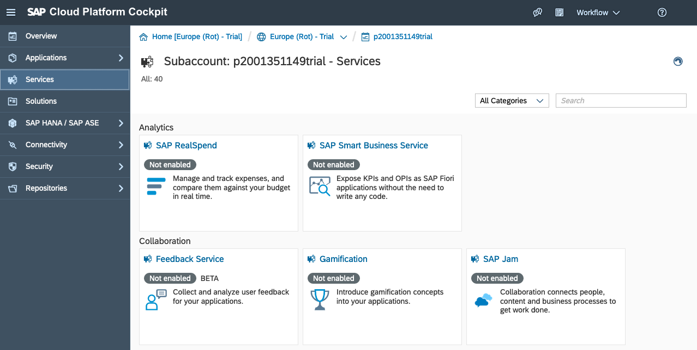
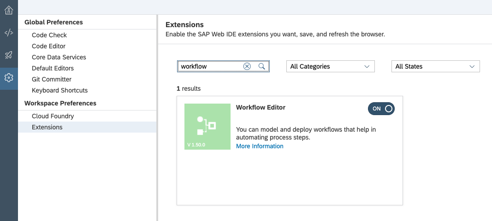
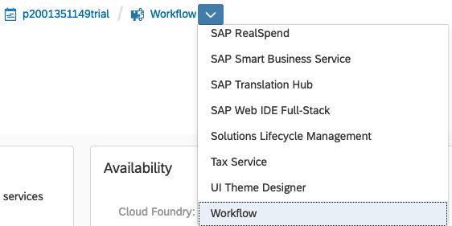

# Exercise 01 - Setting up the SAP Cloud Platform services

In this exercise you'll set up and configure the SAP Cloud Platform services that you'll need in this CodeJam.

There are three services that are required:

- Workflow: the engine and infrastructure that supports workflow on the SAP Cloud Platform
- Portal: for building and managing Fiori Launchpad (and other) sites
- SAP Web IDE Full-Stack: for developing and deploying your workflow definitions

## Steps

After completing these steps you'll have all the services you need in SAP Cloud Platform to create, deploy, run, monitor and consume workflow definitions and instances thereof.

_Note: It's important to enable the services in the order described here, as enabling the Workflow service requires you to have already enabled the SAP Web IDE Full-Stack and Portal services. See [Getting Started with Workflow Service in the Neo Environment](https://help.sap.com/viewer/f85276c5069a429fa37d1cd352785c25/Cloud/en-US/3805ffa92af64eafb6ceff83716262ba.html) for more details. Also, service enablement may take a moment or two, so please be patient._

### 1. Log on and examine the services available

:point_right: Log on to your SAP Cloud Platform trial account, select the "Neo Trial" and choose the "Services" item in the left hand navigation menu of the cockpit.

You should be presented with a list of services, grouped by category. Some services may be already enabled, others need to be enabled explicitly.

### 2. Find and enable the SAP Web IDE Full-Stack service

:point_right: Locate the SAP Web IDE Full-Stack service and enable it if it's not already enabled. Once enabled, follow the "Go to Service" link in the "Take Action" section of the service's main page to open the SAP Web IDE Full-Stack in a new browser tab.

_Note: You can search for the service manually or filter them using the "Developer Experience" category._

:point_right: Make a note of the SAP Web IDE Full-Stack service URL, for example by bookmarking it, so you can get to the service easily later.

### 3. Find and enable the Portal service

:point_right: Return to the services list in your cockpit and go back to locate the Portal service. Enable it if it's not already enabled, TODO

_Note: You can search for the service manually or filter them using the "User Experience" category._

:point_right: Make a note of the Portal service URL, for example by bookmarking it, so you can get to the service easily later.

In order to be able to edit workflow definitions in the SAP Web IDE Full-Stack, you need to make sure the "Workflow Editor" extension is enabled.

:point_right: Switch to the "Preferences" perspective and select the "Extensions" item in "Workspace Preferences". Search for the "Workflow Editor" extension and make sure it's enabled (if you have to enable it, you'll have to use the "Save" button and restart the Web IDE).

### 4. Find and enable the Workflow service

:point_right: Return to the services list in your cockpit and go back to locate the Workflow service. Enable it if it's not already enabled.

_Note: You can search for the service manually or filter them using the "Orchestration" category. Alternatively, with all of these services, you can use the quick switcher as shown._

:point_right: Within the "Take Action" section, use the "Configure Service" link to jump to the Workflow service specific configuration, and select the "Roles" item in the navigation menu. Ensure your user is assigned to all the standard roles listed, by selecting each role in turn, and making sure your user is listed (or added) in the "Individual Users" list for each role.

You'll be playing multiple roles in this CodeJam which is why it's best in this learning context to have all the access you need.

## Summary

You've now enabled the services you need to build, deploy, monitor and use workflow definitions on the SAP Cloud Platform, especially for this CodeJam.

## Questions

1. In the "Orchestration" category of services, what other service is available to you and how might it be useful in a workflow context?

1. You selected the "Neo Trial" to start; what other trial was available? Do you know how it relates, generally, and specifically to the services we're using in this CodeJam?

