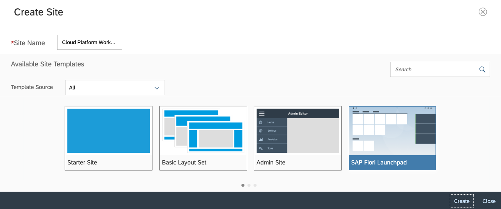
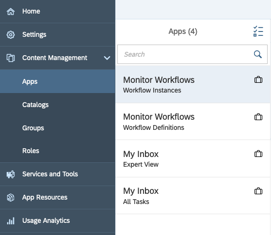
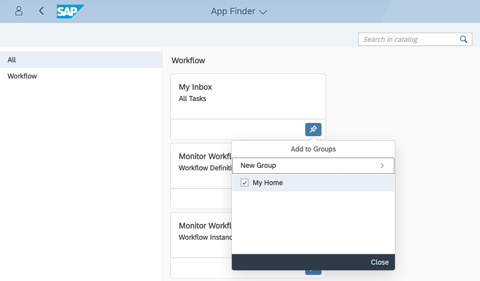
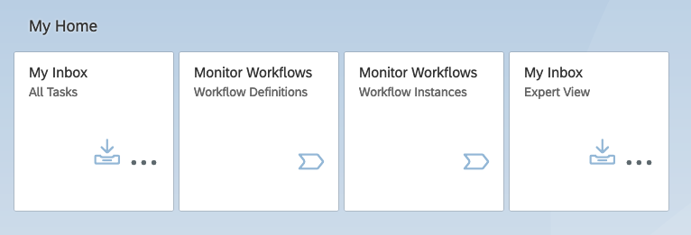
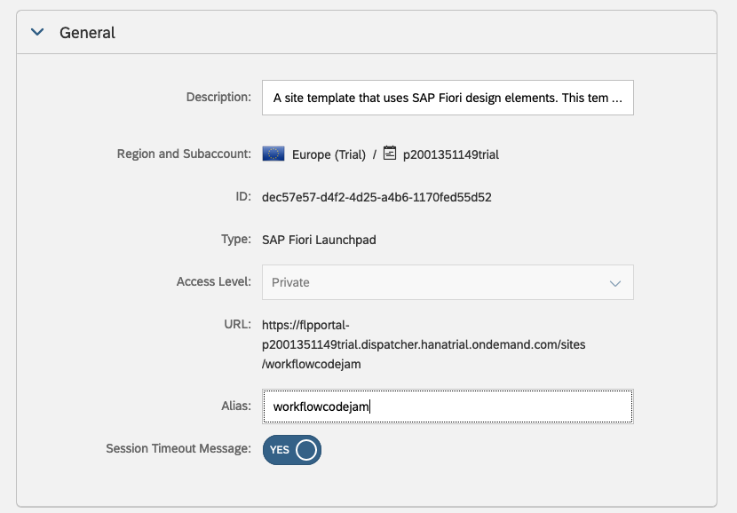

# Exercise 02 - Creating an SAP Fiori launchpad site

In this exercise you'll create a Fiori launchpad site with the My Inbox app, using the Portal service, where you can build websites from templates. One of the templates is for Fiori launchpads.

This Fiori launchpad site will then be the place where you monitor and interact with your workflow definitions and instances in subsequent exercises.

## Steps

After completing these steps you'll have a Fiori launchpad with a number of tiles for invoking workflow related apps.

### 1. Create a new site via the Portal service

:point_right: Open the Portal service (use the URL that you made a note of in the previous exercise) and select "Create New Site", giving it a name (such as "Cloud Platform Workflow CodeJam") and specifying the "SAP Fiori Launchpad" template.



Once you go into the site's configuration area, known as the "Fiori Configuration Cockpit", you should see that there are already four apps pre-configured and available (look in the "Apps" item within "Content Management" in the navigation menu). Note the icon next to each app, denoting that it's been shared from another SAP Cloud Platform subaccount (one providing general Workflow services).



### 2. Publish and open the site

:point_right: In the top right of the Fiori Configuration Cockpit use the "Publish Site" icon to publish the site and open it up, via the "Publish and Open" button in the dialog popup.

The site should appear, and while it will look fairly empty, it's clear that it's a Fiori launchpad site:


_Note: What you see, as we transition to the Fiori 3 design, may look slightly different to what's shown in these screenshots._

### 3. Add the workflow app icons

:point_right: Using the icons at the top, locate the "App Finder" and select and pin all four of the apps to the default "My Home" group:



When you return from the menu, you should see those apps available via the appropriate tiles:



Feel free to explore these apps and try them out. Unless you've looked at the Workflow service before today, there will be no data yet - no inbox items, no workflow definitions and no workflow instances. That will change in the coming exercises!

### 4. Specify an alias for the site

Note that the URL for the launchpad site contains a `siteId` query parameter something like this:

```
https://flpportal-p2001351149trial.dispatcher.hanatrial.ondemand.com/sites?siteId=dec57e57-d4f2-4d25-a4b6-1170fed55d53
```

This makes for a slightly less memorable URL, but it's possible to assign an alias for the site and that can be used instead.

:point_right: Go back to the site's Fiori Configuration Cockpit. If you closed the tab already, you can always reach it again via the site's menu (use the user icon to get to the menu), selecting "Manage Site" (the spanner icon).

:point_right: Select the "Settings" item in the navigation menu, and go into edit mode with the "Edit" button in the bottom right. In the "General" section, specify an alias as appropriate, like this (not forgetting to save after you're done!):



Note that the icon that you previously used in the top right to publish and open the site is now decorated with an asterisk, denoting changes have been made and need to be published.

:point_right: Select the icon to (re)publish and open the site again; you can also select the alias (which is now a hyperlink) from the General section where you added it earlier in this step.

```
https://flpportal-p2001351149trial.dispatcher.hanatrial.ondemand.com/sites/workflowcodejam#Shell-home
```

That's better!

## Summary

You've now set up an SAP Fiori launchpad site, and can invoke the workflow related apps. Note that an individual wouldn't normally have access to all the apps - there's a mixture of end user, power user and workflow developer / administrator apps here:

- End user: My Inbox - All Tasks
- Power user: My Inbox - Expert View
- Developer / administrator: Monitor Workflows - Workflow Definitions & Workflow Instances

## Questions

1. We've seen the phrases "workflow definition" and "workflow instance" a few times now. Do you know what they mean and what they signify?

