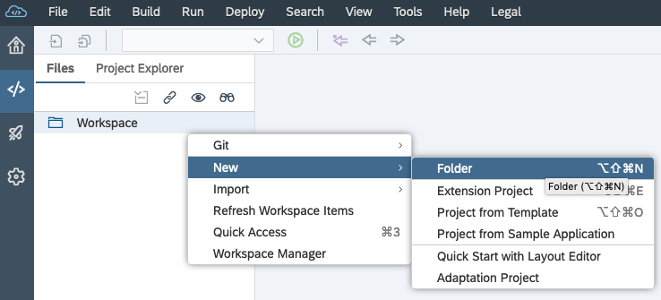
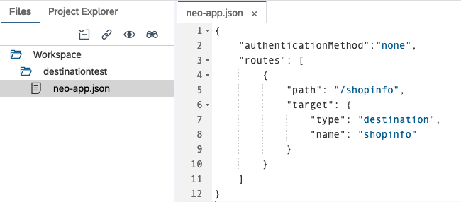
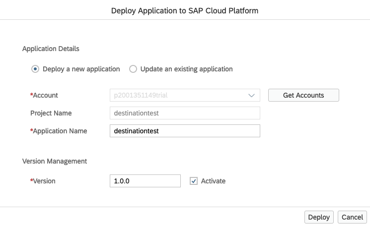

# Exercise 04 - Establishing a destination in SAP Cloud Platform

In this exercise you'll define a destination within the context of the "Connectivity" area of SAP Cloud Platform.

A destination is a collection of parameters that points to a remote service or resource, which might be available on the general Internet or behind a firewall in an on-prem environment. In the latter case an SAP Cloud Connector installed and configured in that on-prem environment enables requests to flow, and that is what we've set up in the previous exercise.

Once a destination is established, it can be used by apps and services running on the SAP Cloud Platform, which has a very capable reverse proxy mechanism at the heart of the Connectivity service.

In this case, for the business scenario upon which this CodeJam is based, the destination will be to a specific OData service providing information relating to an online shop.

_Note: If you were unable to install Docker (as described in this CodeJam's [prerequisites](../../prerequisites.md), you can still continue with this exercise - just follow the special "Without SAP Cloud Connector" instructions where appropriate. You can of course continue with subsequent exercises, as the destination effectively abstracts the actual connection details meaning you can treat it as a logical endpoint after it's been set up._

## Steps

After completing these steps you'll have created a destination pointing to a specific resource in the ES5 system, and tested it out with a very simple app.

### 1. Create a new destination definition

:point_right: In the SAP Cloud Platform Cockpit, select the "Connectivity" menu item, and within that the "Destinations" item. It's likely you'll see a few destinations there already - these will have been created as you enabled services in previous exercises.

:point_right: Select the "New Destination" option, and in the configuration specify values for the appropriate parameters. Some values will depend on whether you have successfully completed the previous exercise and set up the SAP Cloud Connector or not, so the entire value set is presented twice, covering both scenarios. Use the values for your scenario.

**Using SAP Cloud Connector**

If you have an SAP Cloud Connector set up and connected as described in the previous exercise, specify the following properties:

| Property               | Value                   |
| -------------          | ----------------------- |
| Name                   | shopinfo                |
| Type                   | HTTP                    |
| Description            | CodeJam Shop Info       |
| URL                    | `http://virtuales5:8000/sap/opu/odata/sap/EPM_REF_APPS_SHOP_SRV/` |
| Proxy Type             | OnPremise               |
| Location ID            | (leave blank)           |
| Authentication         | BasicAuthentication     |
| User                   | (your ES5 username)     |
| Password               | (your ES5 password)     |


**Without SAP Cloud Connector**

If you were unable to set up an SAP Cloud Connector in the previous exercise, you should set up the destination to point directly to ES5.

_Note: We're only "pretending" that the ES5 system is on-prem; it is, in fact, available directly on the public Internet._

| Property               | Value                   |
| -------------          | ----------------------- |
| Name                   | shopinfo                |
| Type                   | HTTP                    |
| Description            | CodeJam Shop Info       |
| Location ID            | (leave blank)           |
| URL                    | `https://sapes5.sapdevcenter.com:443/sap/opu/odata/sap/EPM_REF_APPS_SHOP_SRV/` |
| Proxy Type             | Internet                |
| Authentication         | BasicAuthentication     |
| User                   | (your ES5 username)     |
| Password               | (your ES5 password)     |

:point_right: In _both_ cases (whether you have an SAP Cloud Connector or not), add the following property / value pair in the "Additional Properties" section using the "New Property" button, and then save the entire destination definition with the "Save" button:

| Property               | Value                   |
| -------------          | ----------------------- |
| sap-client             | 002                     |

### 2. Create and deploy a simple test app

It is worth testing the new destination with a small bit of configuration that is normally used to define remote sources that are to be accessed by HTML5 apps. You will do that in this step, by creating the simplest app definition using the SAP Web IDE Full-Stack, and deploying it to the SAP Cloud Platform, and then testing the destination via that configuration.

:point_right: Go to the SAP Web IDE Full-Stack. If you don't have the URL bookmarked, go via the Services navigation menu item in the SAP Cloud Platform Cockpit, select the SAP Web IDE Full-Stack service, and use the "Go to Service" link.

:point_right: Once in the SAP Web IDE Full-Stack, go to the Development perspective (via menu option View -> Development). There, use the context menu (i.e. right-click) on the "Workspace" folder to create a new folder:



Call the new folder "destinationtest".

:point_right: Take the [neo-app.json](neo-app.json) file from this repository (save the "Raw" version) and upload it, with the same name, to this new "destinationtest" folder, using the context menu "Import -> File or Project", so that you end up with something that looks like this:



Make sure the name of this file is `neo-app.json`.

:point_right: Now deploy this "app" (there's nothing there except for this routing information, but it suffices for what we need) to SAP Cloud Platform, by using the context menu path "Deploy -> Deploy to SAP Cloud Platform" on the "destinationtest" folder. In the dialog that appears, leave everything as it is, and select the "Deploy" button:



You should just select "Close" in the subsequent "Successfully Deployed" dialog as there's no requirement to register this "app" to any SAP Fiori launchpad.

### 3. Use the app route info to test the destination

You should be able to find the app via the SAP Cloud Platform Cockpit, in the "Applications -> HTML5 Applications" navigation menu item:


:point_right: Select the app's link ("destinationtest") to see an overview of the app's details. You should see that it's started, and the "Required Destinations" have been successfully mapped.

:point_right: In the "Active Version" box, there will be a hyperlink to the app itself, that looks something like this:

```
https://destinationtest-<subaccountname>.dispatcher.hanatrial.ondemand.com
```

:point_right: Select this hyperlink; you should be presented with an "HTTP Status 404 - Not Found" error, as there's no default document at the root of the app. But you can still use the route mappings in the app's `neo-app.json` file - simply append `shopinfo` to the URL (first removing the `?hc_reset` query parameter) and you should be presented with some XML.

The URL should look like this:

```
https://destinationtest-<subaccountname>.dispatcher.hanatrial.ondemand.com/shopinfo
```

That XML is the service document of the shop info OData service, coming all the way from the ES5 system, through the SAP Cloud Connector (if you've installed it and set it up), via the Connectivity service to your browser.

Great!

### 4. Explore the Products entityset

You'll be using data from the Products entityset in the OData service you've just exposed, so use this step to explore the data in that entityset, so you're at least a little bit familiar with it.

:point_right: Append `Products` to the end of the existing URL, so it looks like this:

```
https://destinationtest-<subaccountname>.dispatcher.hanatrial.ondemand.com/shopinfo/Products
```

:point_right: Explore the data that is returned - you should see a list of products, with the sort of properties you'd expect from a product database, such as an ID, name, description, information about stock quantity, and so on.

If you prefer looking at JSON rather than XML, append the query parameter `$format=json` to the URL, so that it looks like this:

```
https://destinationtest-<subaccountname>.dispatcher.hanatrial.ondemand.com/shopinfo/Products?$format=json
```

_Note: It's at this point you might want to take advantage of the [recommendations](../../prerequisites.md#recommendations) to install formatters for JSON and XML in Chrome._

Notice that there are products with IDs such as "HT-1001" and "HT-1002" representing computer hardware such as laptops.


## Summary

You've now created a destination in the SAP Cloud Platform, and have successfully tested it, surfacing information from the remote ES5 system via a simple route mapping definition as part of a skeleton app. (You won't need this app any more, so you can delete it if you want to).

You're now all set to be able to successfully consume the OData service at the endpoint you've defined in the destination from other services, in particular, the Workflow service.

## Questions

1. What do you think the "Location ID" property is used for? How might we use it here, if we wanted to specify a value?

1. What is going on with the "Required Destinations" mappings in the "destinationtest" app? What do you think it means?
