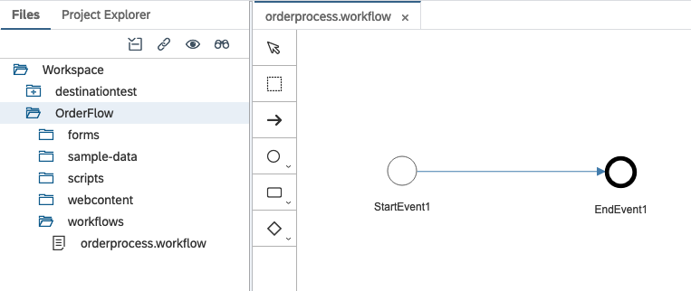
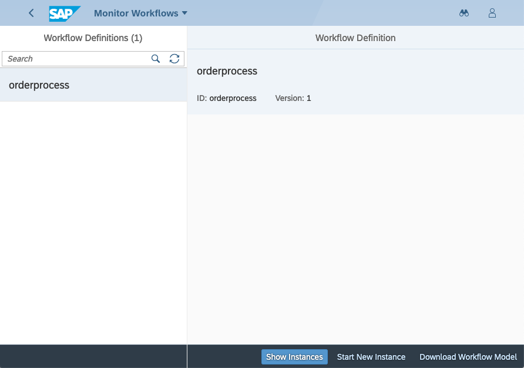

# Exercise 05 - Creating, deploying & instantiating a simple workflow

In this exercise you'll create the simplest workflow definition possible, and deploy it to SAP Cloud Platform, whereupon you'll use the workflow related apps you set up in your Portal service powered Fiori launchpad site to create an instance of the definition and look at it.

## Steps

After completing these steps you'll understand the general flow of development, deployment and usage of workflows on SAP Cloud Platform.

### 1. Create a new Workflow project in the SAP Web IDE Full-Stack

:point_right: Open up the SAP Web IDE Full-Stack (you may have it already open from the previous exercise) and create a new project with menu path "File -> New -> Project from Template". In the steps that follow, make these selections:

**Template Selection**

| Property               | Value                   |
| -------------          | ----------------------- |
| Environment filter     | Neo                     |
| Category filter        | Business Process Management |
| Template selection     | Workflow Project            |

**Basic Information**

| Property               | Value                   |
| -------------          | ----------------------- |
| Project Name           | OrderFlow               |

**Workflow Details**

| Property               | Value                   |
| -------------          | ----------------------- |
| Name                   | orderprocess            |
| Description            | Simple CodeJam workflow |

_Note: the names of the project, and the workflow definition within it, are deliberately different here, to highlight that they're not the same thing - you can have multiple workflow definitions in a single workflow project._

You should end up with a very simple workflow definition, that looks like this:

Observe that the workflow definition editor is graphical, and the file that represents the definition is within a `workflows/` directory within the project.

### 2. Deploy the definition to the cloud

While this workflow definition doesn't do very much, we can still carry out an initial exploration with the apps we set up in a previous exercise. So in this step we'll deploy the definition to SAP Cloud Platform to be able to do that.

:point_right: Locate the definition file `orderprocess.workflow` and use the context menu "Deploy -> Deploy to SAP Cloud Platform Workflow". You should see a message confirming that the deployment was successful.

That's it!

_Note: here you only deployed a workflow definition; more involved workflow projects also include forms and other UI elements - these are deployed separately, as you will see in a later exercise._

### 3. Examine the workflow definition and create an instance of it

:point_right: Go to your Fiori launchpad site and start the "Monitor Workflows - Workflow Definitions" app. You should see something like this:

You can see that this is version 1 of the definition, the first version you've deployed (the version number is incremented automatically on each new deploy).

Here you can start a new instance, which is what you should do now. Built in to the system is some simple test data that can be used to populate new instances of workflow definitions for testing purposes. You can, if you wish, modify or completely overwrite the test data.

:point_right: Use the "Start New Instance" button, and in the dialog that appears, leave the test data as it is, and continue with the "Start New Instance" button to have an instance of your workflow definition created. A message should appear briefly to confirm that.

### 4. Look at the workflow instance

:point_right: Switch to looking at the workflow instance you created, by using the "Show Instances" button.

You should see a filtered display in the master list ... but it's likely that you won't find your newly created instance. This is because the default filter is to show instances with the following status values:

- Erroneous
- Running
- Suspended

Because of the simplicity of your workflow definition right now, the instance has already completed.

:point_right: Use the filter icon at the bottom of the master list to add the status "Completed" to the status values.

You should now see your instance. There's plenty of information to examine.

:point_right: Take a couple of minutes to explore the information.

## Summary

You've now gone through the process of bringing a workflow definition from your development environment (the SAP Web IDE Full-Stack) to the Workflow service on the SAP Cloud Platform, and using the administration apps to create and examine instances of it. You'll find that the "Monitor Workflows - Workflow Instances" app is a very useful tool.

## Questions

1. There are two tiles to look at workflow information - definitions and instances. Are there actually two apps? How did you jump from looking at your definition to looking at instances of it? What changed in the URL when you jumped?

1. What sort of information did you find when examining the completed workflow instance? Did you understand what everything was? What was in the workflow context, and what did you see when you selected "Show Tasks"?
