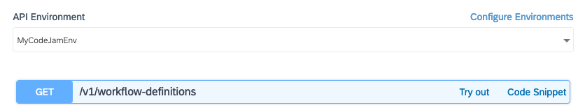

# Exercise 06 - Exploring the API Hub and the Workflow API

In this exercise you'll take a look at the details of the Workflow service API in the SAP API Business Hub, and use the API to create an instance of your `orderprocess` definition.

## Steps

After completing these steps you'll have set up an environment in the SAP API Business Hub that reflects the details of your personal trial account, and tried out a couple of API calls to start off a workflow via the API.

### 1. Log on to SAP API Business Hub

:point_right: Go to the [SAP API Business Hub](https://api.sap.com/) and log on.

This is the central place for discovery and consumption of APIs - see it as your "one stop shop" to learn about and try out APIs in the SAP universe. Take a few moments to look around and familiarize yourself with the site.

### 2. Find the Workflow API

The Workflow API is of course documented and available for exploration here in the API Hub.

:point_right: [Search for](https://api.sap.com/search?searchterm=workflow%20API) the Workflow API - you should find a number of results. The one we're interested in for this CodeJam is the [Workflow API for Neo](https://api.sap.com/api/SAP_CP_Workflow/resource). You should see something like this:


It describes the different aspects that the API covers, such as:

- User Task Instances
- Workflow Definitions
- Workflow Instances
- Forms

and so on.

For each aspect there are a number of verb/noun combinations, in the form of HTTP methods (representing the verbs) and URL paths (representing the nouns). This noun/verb approach suggests that the Workflow API exhibits some qualities of the Representational State Transfer (REST) architectural style.

:point_right: Explore each of the aspects, in particular "Workflow Instances" and "XSRF Handling". Try to identify which verb/noun combination in the "Workflow Instances" aspect would be appropriate to create a new instance of a workflow definition.

### 3. Configure an API Environment

In the API Hub you can not only explore but try out APIs. For this, there's a sandbox environment provided, but it's better and more convenient to set up an API environment that reflects your setup. In this step you'll do just that, setting up an API environment that reflects your SAP Cloud Platform trial account and the Workflow service you have enabled there.

:point_right: At the top of the Workflow API details, select the "Configure Environments" link to get to a dialog where you can create a new environment. You should see something like this:


You should be defaulted to the "Create New Environment" mode.

:point_right: Specify the following values, noting that the Starting URL selection needs to be based on the fact that you are using your trial account in the Neo environment:

| Property       | Value                   |
| -------------- | ----------------------- |
| Starting URL   | ` https://bpmworkflowruntime{provideraccountname}-{consumeraccountname}.hanatrial.ondemand.com/workflow-service/rest` |
| Display Name for Environments | MyCodeJamEnv |
| provideraccountname           | wfs          |
| consumeraccountname           | <your trial account, e.g. p2001351149trial> |
| Authentication Type           | Basic Authentication |
| Username                      | <your trial account username, e.g. p2001351149 > |
| Password                      | <your trial account password> |
| Apply this environment to all APIs in this package that are not yet configured | _checked_ |
| Save this environment for future sessions | _selected_ |

Don't forget to save the settings when you're done.

### 4. Request workflow definition information via the API

Now you can try out your new API environment by requesting information on the workflow definitions that you've already deployed to the Workflow service. If this is your first experience with the Workflow service, you should just see the single `orderprocess` definition in the results.

:point_right: Select the "Workflow Definitions" aspect, and identify the verb/noun combination:

```
GET /v1/workflow-definitions
```

:point_right: Select your new API environment in the dropdown selection at the top of the verb/noun list, so that the "MyCodeJamEnv" environment is shown as selected.



:point_right: Use the "Try out" link to expand and explore the API call. You can leave all the parameters as they are, and use the "Execute" button to make the API call.

An API call is made for you, with your credentials, in the context of the environment that you defined. The results are shown, including the HTTP status code (200), the body of the response, and the response headers. They should look something like this:

**Response body**

```json
[
  {
    "id": "orderprocess",
    "version": "1",
    "name": "orderprocess",
    "createdBy": "P2001351149",
    "createdAt": "2019-05-28T11:24:30.589Z",
    "jobs": []
  }
]
```

**Response headers**
```
Strict-Transport-Security: max-age=31536000; includeSubDomains; preload
Date: Wed,  29 May 2019 08:11:55 GMT
Transfer-Encoding: chunked
Expires: Thu,  01 Jan 1970 00:00:00 GMT
Content-Type: application/json
Server: SAP
X-Content-Type-Options: nosniff
Cache-Control: private
```

You've just made your first API call - nice work!

### 5. Create a new workflow instance via the API

Now that you've tried out a simple API call, it's time to use the API to create a new instance of your `orderprocess` workflow definition.

This time you'll be making two calls - the first to request a CSRF token, and the second to use that token and create an instance of the workflow definition. CSRF stands for [Cross Site Request Forgery](https://en.wikipedia.org/wiki/Cross-site_request_forgery) and the token system is part of a mechanism designed to reduce such forgery based attacks. Basically, if you want to make an API call that has side effects in the remote system (e.g. the creation of a new workflow instance, in this case), then you will need to make sure that a valid CSRF token is supplied in that call. A valid token can be requested using the URL path that you see in the "XSRF Handling" API aspect.

_Note: The acronyms CSRF and XSRF are used interchangeably._

**Requesting a CSRF token**

:point_right: Select the `GET /v1/xsrf-token` verb/noun combination from the "XSRF Handling" aspect of the API, and use the "Try out" link to be able to execute a call. You should see that the value defaulted into the `X-CSRF-Token` header is "Fetch", which is what we need (i.e. we are asking for a token). Use the "Execute" button to make the call.

The response should also show an HTTP 200 status code, no response body, but in the headers, you should see that a token has been supplied:

```
X-CSRF-Token: 3E1B5D7DA9ADA90834B22961CA2FB50D
Strict-Transport-Security: max-age=31536000; includeSubDomains; preload
Date: Wed,  29 May 2019 08:27:47 GMT
Content-Length: 0
Expires: Thu,  01 Jan 1970 00:00:00 GMT
Server: SAP
X-Content-Type-Options: nosniff
Cache-Control: private
```

:point_right: Make a note of this token (e.g. copy it somewhere) because you will need it in the next call.

**Requesting the creation of a new workflow instance**

Now that you have a valid CSRF token, you can make the call to create a new workflow instance.

:point_right: Select the "Workflow Instances" aspect and thence the `POST /v1/workflow-instances` verb/noun combination. Select the "Try out" link to be able to set up and execute the call.

:point_right: Paste the CSRF token that you received in the previous call into the input box for the "X-CSRF-Token" parameter.

A payload is sent with this call, and you specify it in the "body" parameter here.

:point_right: Specify the following for the value of the "body" parameter, being careful to get it exactly right, as it's JSON and quotes, colons and curly braces matter:

```json
{
  "definitionId": "orderprocess",
  "context": {
    "request": {
      "Id": "HT-1002",
      "Quantity": 42
    }
  }
}
```

:point_right: Use the "Execute" button to send the request.

You should see a response with an HTTP status code of 201, and a response body & response headers that look like this:

**Response body**

```json
{
  "id": "a8127e85-81ec-11e9-a9f7-00163e8d2b7b",
  "definitionId": "orderprocess",
  "definitionVersion": "1",
  "subject": "orderprocess",
  "status": "RUNNING",
  "businessKey": "",
  "startedAt": "2019-05-29T08:35:04.679Z",
  "startedBy": "P2001351149",
  "completedAt": null
}
```

**Response headers**

```
Strict-Transport-Security: max-age=31536000; includeSubDomains; preload
Date: Wed,  29 May 2019 08:35:08 GMT
Transfer-Encoding: chunked
Content-Type: application/json
Server: SAP
X-Content-Type-Options: nosniff
```

Great!

### 6. Check the newly created instance in the Fiori launchpad

It is of course possible to use the "Workflow Monitor - Workflow Instances" to view this newly created instance. You can do that in this step.

:point_right: Open up the "Workflow Monitor - Workflow Instances" app in your Fiori launchpad site. Don't forget to ensure that the filter is still allowing the display of instances in the "Completed" state.

_Note: By the time you open the app, the instance will have completed, but it's nice to see the status immediately after creation, which was shown in the response body to the `POST /v1/workflow-instances` request. This status, as you can see above, was "RUNNING"._

:point_right: Examine the details for the instance, and try to match values up with what you saw from the results of the API call. You should be able to see that the values for the "Instance ID" and "Started At" properties, for example, are the same.

_Note: Timezones play a part in dates and times, so the hour values may be offset - the time given in the API output is in UTC._

Here's an example of what you might see:


## Summary

You've explored the Workflow API in the API Hub and successfully started a workflow instance via that API, supplying data that finds its way into the context of that instance. You've also managed to find evidence of that instance in the administration UI. Nice work!

## Questions

1. What do the "provideraccountname" and "consumeraccountname" represent? What do you think "wfs" stands for?

1. Why are there square brackets surrounding the response to the `GET /v1/workflow-definitions` API call?

1. In the payload of the `POST` call to `/v1/workflow-instances`, can you explain all aspects of the data contained therein?

1. What does HTTP response code 201 signify and how does it differ from 200?
